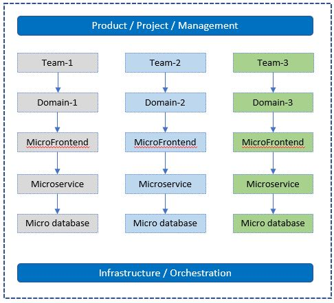
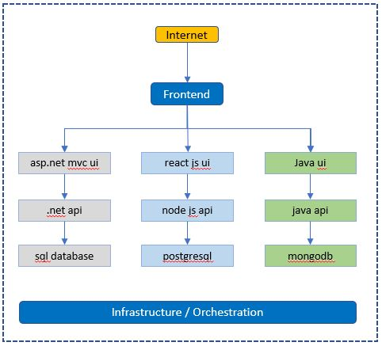
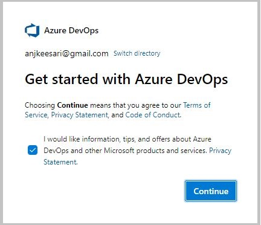
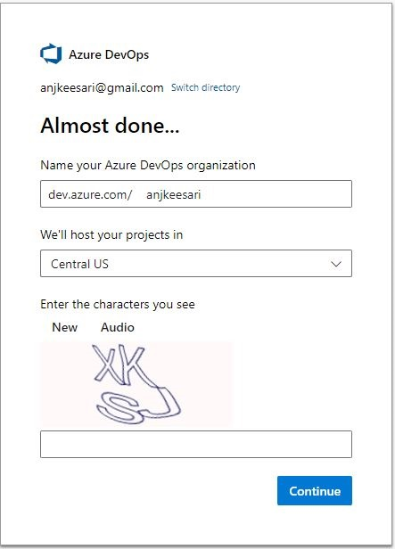
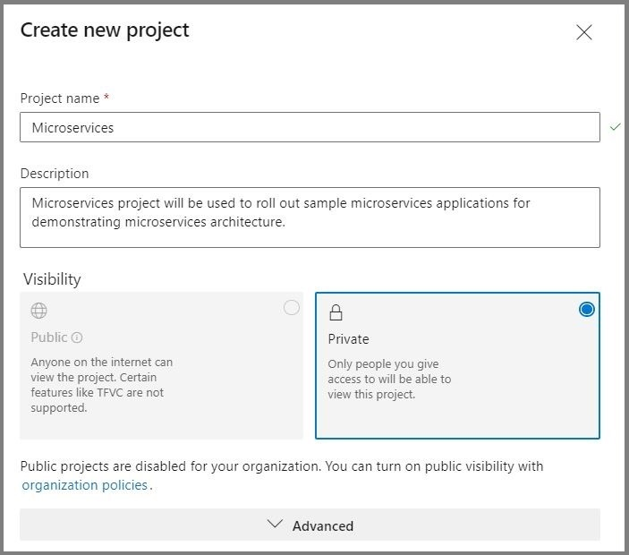

# Chapter-1: Getting Started with Microservices

## Overview

Welcome to the first chapter of our book. In this chapter, we will begin our journey by understanding microservices architectures and how they are different comparing with traditional monolithic architectures. We'll also learn the advantages of the microservices architectures, including scalability, flexibility, and easier maintenance. we will also learn challenges with microservices and considerations that need to be carefully addressed, key technologies and communication patterns. Finally we will perform four tasks such as identifying list of microservices, git repos needed, create org and project in azure devops to continue our journey in this book.


## Objective

In this exercise, our objective is to accomplish and learn the following tasks:

- [What are Microservices?](#what-are-microservices)
- [Microservices vs Monolithic Architectures](#microservices-vs-monolithic-architectures)
3. [Advantages of Microservices](#advantages-of-microservices)
4. [Challenges and Considerations](#challenges-and-considerations)
5. [Key Technologies and Tools](#key-technologies-and-tools)
6. [Microservices Communication](#microservices-communication)
6. [Domain-Driven Design (DDD)](#domain-driven-design-ddd)
7. [Task-1: Identify Microservices for the book](#task-1-identify-microservices-for-the-book)
7. [Task-2: Identify the List of Git Repositories Needed](#task-2-identify-the-list-of-git-repositories-needed)
7. [Task-3: Create new Azure DevOps Organization](#task-3-create-new-azure-devops-organization)
7. [Task-4: Create new Azure DevOps Project](#task-4-create-new-azure-devops-project)


## What are Microservices?

`Microservices` are architectural style that structures an application as a collection of small, independent, and loosely coupled services. These services, known as microservices  , are designed to be self-contained and focused on specific functions or features of the application. Unlike monolithic applications, where all components are tightly integrated into a single codebase, microservices allow for the decomposition of an application into smaller, manageable parts.

Key Characteristics:

- Autonomous and independently deployable
- Organized around business capabilities
- Technology-agnostic (can be built using different languages/platforms)
- Decentralized data management
- Fault isolation

## Microservices vs Monolithic Architectures


*Monolithic Architectures:*

- In a monolithic architecture, the entire application is built as a single, unified codebase.
- All components of the application, including user interfaces, business logic, and data access layers, are tightly coupled.
- Scaling a monolithic application typically involves replicating the entire application, even if only specific parts require additional resources.
- Maintenance and updates often require making changes to the entire codebase, making it challenging to isolate and fix issues.

*Microservices:*

- Microservices architecture promotes breaking down the application into smaller, independent services.
- Each microservice is responsible for a specific application's functionality.
- Microservices can be developed, deployed, and scaled independently.
- Updates and maintenance are easier to manage, as changes to one microservice do not impact the entire system.


## Advantages of Microservices

Microservices architecture offers several advantages, including:

- **Scalability:** Microservices can be easily scaled horizontally to handle increased traffic, ensuring that the system remains responsive during high-demand periods.

- **Flexibility:** Developers can work on individual microservices without affecting the entire application. This makes it easier to introduce new features, fix bugs, or update a specific service without disrupting the entire system.

3. **Easy Maintenance:** Smaller, self-contained services are typically easier to maintain and manage. Updates and changes can be isolated to specific microservices, reducing the risk of unintended consequences.

4. **Improved Fault Isolation:** When a microservice fails, it usually doesn't bring down the entire system. Failures are contained within the affected service, minimizing the impact on the overall application.

5. **Technology Agnosticism:** Microservices allow you to use different technologies and programming languages for different services, which can be chosen based on the specific requirements of each service.

6. **Rapid Development:** Smaller teams can work independently on microservices, enabling faster development cycles and quicker time-to-market for new features or products.

7. **Enhanced Testing:** Isolated microservices can be tested more thoroughly, leading to better quality assurance and reduced testing complexity compared to monolithic applications.

9. **Easier Deployment:** Smaller, independent services are easier to deploy, reducing the risk of deployment failures and making it possible to implement continuous integration and continuous delivery (CI/CD) practices.


## Challenges and Considerations

While microservices offer numerous advantages, they also come with their set of challenges and considerations that need to be carefully addressed. Careful planning and architectural decisions are important for realizing the benefits of microservices while mitigating their challenges.

*Challenges of microservices*

- **Complexity**: Microservices introduce complexity, as an application is divided into multiple services, each with its own codebase, data store, and dependencies. Managing the interactions between microservices and ensuring the overall system's integrity can be challenging.

- **Data Consistency**: Maintaining data consistency in a distributed microservices architecture can be complex. With each microservice managing its data, ensuring data synchronization and integrity across services is important.

3. **Distributed Systems Issues**: Microservices are inherently distributed, which introduces challenges such as network latency, message serialization, and handling communication failures. Implementing robust error handling and resilience mechanisms becomes essential.

4. **Operational Complexity**: Managing and monitoring a large number of microservices in a production environment can be operationally complex.  Tools and practices for deployment, monitoring, and scaling need to be in place to ensure smooth operations.

*Considerations for Microservices Adoption*

- **Application Complexity**: Microservices are well-suited for complex, large-scale applications with multiple modules or functionalities. For simpler applications, a monolithic architecture may be more appropriate.

- **Team Structure**: Consider your organization's team structure. Microservices often align with small, cross-functional teams that can own and manage individual microservices. Ensure your teams have the necessary skills for microservices development and operations.

3. **Scalability and Performance**: Microservices can provide scalability benefits, particularly for applications with varying workloads. Evaluate whether your application requires the ability to scale individual components independently.

4. **Frequent Updates**: If your application requires frequent updates and releases, microservices can support continuous integration and deployment practices. Ensure you have the necessary CI/CD pipelines and infrastructure.

*Choosing the Right Architecture*


The choice between monolithic and microservices architecture depends on various factors, including the complexity of the application, team structure, scalability requirements, and development speed. Monolithic architectures excel in simplicity and are suitable for smaller applications with straightforward requirements. Microservices, on the other hand, offer flexibility and scalability for larger, more complex applications but introduce operational complexities.

## Key Technologies and Tools

Microservices development relies on a set of essential technologies and tools that facilitate the creation, deployment, and management of individual microservices. 

- **Docker:** Docker is a containerization platform that allows developers to package applications and their dependencies into lightweight containers.  Docker containers provide consistency in deployment across different environments, ensuring that microservices run reliably on any system.

- **DevContainers:** DevContainers streamline the development and testing of microservices locally by providing a controlled, isolated, and consistent environment that enhances collaboration among team members and simplifies the management of complex microservices ecosystems.

- **Kubernetes:** Kubernetes is a container orchestration platform that automates the deployment, scaling, and management of containerized applications, including microservices. Kubernetes simplifies the management of microservices at scale, enabling features like load balancing, auto-scaling, and rolling updates.

<!-- - **Service Mesh:** Service mesh technologies enhance microservices communication, offering features like traffic management, load balancing, security, and observability. Service meshes improve the reliability and resilience of microservices by handling communication between services, implementing policies, and providing insights into traffic. -->

- **API Gateways:** API gateways act as a front-end for microservices, providing a unified entry point for clients and handling tasks such as authentication, rate limiting, and request routing. API gateways simplify client interactions with microservices, centralize security controls, and enable API versioning and documentation.

- **Continuous Integration/Continuous Deployment (CI/CD) Tools:** CI/CD tools such as Azure DevOps, Argocd, Helmcharts automate the building, testing, and deployment of microservices, supporting rapid development and delivery. CI/CD pipelines streamline the development process, allowing for frequent updates and reducing the risk of errors.

- **Monitoring and Observability Tools (e.g., Prometheus, Grafana, Jaeger):** Monitoring and observability tools provide insights into the performance, availability, and behavior of microservices, helping to detect and troubleshoot issues. These tools ensure the reliability of microservices in production by offering real-time monitoring, logging, and tracing capabilities.

## Microservices Communication

Microservices can communicate with each other using different communication patterns, both synchronous and asynchronous.

**Synchronous:**

- *HTTP/HTTPS*: Microservices can communicate over standard HTTP/HTTPS protocols, making it easy to create RESTful APIs or web services.
   Synchronous communication is suitable for scenarios where immediate responses are required.

- *gRPC*: gRPC is a high-performance, language-agnostic remote procedure call (RPC) framework that allows microservices to communicate efficiently. It is ideal for scenarios where low-latency, binary-encoded communication is needed.

**Asynchronous:**

- *Message Queues (e.g., RabbitMQ, Apache Kafka)*: Microservices can exchange messages through message queues or publish-subscribe systems.
Asynchronous communication is useful for decoupling services and handling background tasks or event-driven scenarios.

2. *Event Sourcing and Event-driven Architecture*: In event-driven architecture, microservices issue and consume events to communicate changes or trigger actions. This pattern is beneficial for building scalable, loosely coupled systems that respond to real-time events.

## Domain-Driven Design (DDD) 

Domain-Driven Design (DDD) is a set of principles, patterns, and techniques for designing applicatio with a focus on the domain of the problem being solved. In the context of microservices architecture, DDD plays a importantent role in helping you define the boundaries of your microservices and ensure that they align with your business domain. Here's how DDD techniques can be applied in microservices architecture:


- **Bounded Contexts**:In DDD, a bounded context is a specific boundary within which a domain model is defined and applicable. In microservices, each microservice typically corresponds to a bounded context. Bounded contexts ensure that each microservice has a well-defined scope and encapsulates a specific aspect of the business domain.

- **Aggregates**: Aggregates in DDD represent a cluster of domain objects treated as a single unit. In microservices, an aggregate can be considered a microservice that manages a set of related entities. Microservices encapsulate aggregates and provide APIs for manipulating them. This helps maintain data consistency and isolation.

- **Entities and Value Objects**: DDD distinguishes between entities (objects with a distinct identity) and value objects (objects with no distinct identity). In microservices, entities and value objects are used to model domain concepts within the microservice's scope, helping to define data structures and behavior.

- **Context Mapping**: Context mapping in DDD deals with defining relationships and interactions between bounded contexts. It helps manage the integration points between different parts of the system.
 In microservices architecture, context mapping is essential for specifying how microservices interact and communicate with each other, either through APIs or messaging.

<!-- 
- **Small, Independent, and Loosely Coupled:** Microservices are designed to be small and focused on specific business capabilities. They are independent entities that can be developed, deployed, and scaled individually. This loose coupling allows for greater flexibility and agility.

- **Self-Contained Services:** Each microservice is self-contained and encapsulates a specific functionality or feature. It can be developed and maintained by a small team of developers, promoting autonomy and faster iteration.

- **Bounded Context and Business Capabilities:** Microservices are designed to implement a single business capability within a bounded context. They are responsible for a specific task or function and should strive to be cohesive and aligned with a well-defined domain.

- **Separate Codebases and Teams:** Each microservice has its own separate codebase, enabling independent development and deployment. A small development team can manage and maintain a microservice, fostering ownership and accountability.

- **Data and State Responsibility:** Microservices are responsible for persisting their own data or managing external state relevant to their specific functionality. This allows for better encapsulation and isolation of data within each microservice.

By using microservices architecture, organizations can achieve greater scalability, maintainability, and resilience in their applications. It promotes modularity, enables independent development and deployment, and supports the evolution of complex systems.

In the labs ahead, we will explore the practical implementation of microservices using Kubernetes and related tools. Let's continue our journey and delve deeper into building and deploying microservices in a distributed environment. -->


## Domain-Driven Design (DDD) Example

Let’s take a `detailed real-world example` of a microservices-based application following `Domain-Driven Design (DDD)` principles. This example will helps you to understand how to identify bounded contexts, define microservices, map databases per service, and see how this all ties together into a cohesive system.


Scenario: Online Retail Platform (E-Commerce System)

You are building a modern online retail platform similar to Amazon or Flipkart. The platform needs to handle:

* Product management
* Customer management
* Orders and payments
* Inventory tracking
* Notifications
* Authentication and authorization


Applying DDD: Identify Bounded Contexts

In DDD, each bounded context becomes a candidate for a microservice. Here’s how the domain breaks down:

| Bounded Context         | Description                                     |
| ----------------------- | ----------------------------------------------- |
| **Product Catalog**     | Manages product details, categories, pricing    |
| **Customer Management** | Handles user registration, profile, and address |
| **Order Management**    | Creates and tracks customer orders              |
| **Inventory**           | Manages stock levels per product and location   |
| **Payment**             | Handles payment processing, refunds             |
| **Notification**        | Sends emails/SMS for order updates              |
| **Authentication**      | User login, token issuance, role-based access   |

---

Microservices List with Databases

| Microservice            | Responsibility                                  | Database                 | Technology Stack  |
| ----------------------- | ----------------------------------------------- | ------------------------ | ----------------- |
| **ProductService**      | Add/update product catalog, categories, pricing | SQL Server / PostgreSQL  | .NET Core Web API |
| **CustomerService**     | Manage user profile, address, contact info      | PostgreSQL               | .NET Core Web API |
| **OrderService**        | Place order, track order status, order history  | SQL Server               | .NET Core Web API |
| **InventoryService**    | Check and update stock, warehouse mapping       | MongoDB / PostgreSQL     | Node.js / .NET    |
| **PaymentService**      | Handle payments, payment status, refunds        | PostgreSQL               | Node.js           |
| **NotificationService** | Send order/shipping alerts via email/SMS        | No DB / Redis Queue      | Node.js           |
| **AuthService**         | Register/login users, token issuance, RBAC      | PostgreSQL (Keycloak DB) | Keycloak (Docker) |

Each microservice:

* Has its own isolated **data store**
* Manages its own **business rules**
* Communicates with others via **REST APIs** or **message queues**


Microservice Interactions (Example Flow)

User places an order:

1. **AuthService** validates user token.
2. **OrderService** creates order, validates customer and product.
3. **ProductService** provides product pricing.
4. **InventoryService** checks and reserves stock.
5. **PaymentService** processes payment.
6. **NotificationService** sends confirmation email/SMS.
7. **OrderService** updates order status.

These services can be chained using **REST** (synchronous) or **Kafka/RabbitMQ** (asynchronous).

Databases per Microservice (DB-per-Service Pattern)

Each microservice owns its own database schema and is responsible for reading/writing to it.

| Microservice        | Database Type    | Reason                                        |
| ------------------- | ---------------- | --------------------------------------------- |
| ProductService      | PostgreSQL       | Relational data, joins for categories         |
| CustomerService     | PostgreSQL       | Structured customer records                   |
| OrderService        | SQL Server       | Order lifecycle with transactional guarantees |
| InventoryService    | MongoDB          | High write-read throughput, document model    |
| PaymentService      | PostgreSQL       | Transactional ACID compliance                 |
| NotificationService | Redis (Optional) | Queueing and retry tracking                   |
| AuthService         | PostgreSQL       | Used internally by Keycloak                   |

## Task-1: Identify Microservices for the book

To fully explore the microservices architecture in this book, we will create several containerized microservices and microfrontend applications and couple of databases. These applications will allow us to demonstrate real-world scenarios and provide a practical understanding of microservices implementation. In this case study, we will create the following microservices, which will be developed in the upcoming labs.  we have purposely selected diverse options to ensure a broader learning experience.


| Microservice/Website/Database | Technology Used         | Name          |
|-------------------------------|-------------------------|---------------|
| First Microservice            | .NET Core Web API (C#)  | aspnet-api    |
| Second Microservice           | Node.js (Node)          | nodejs-api    |
| First Website                 | ASP.NET Core MVC (C#)   | aspnet-app    |
| Second Website                | React.js (Node)         | react-app     |
| First Database                | SQL Server              | sqlserver-db  |
| Second Database               | PostgreSQL              | postgresql-db |
| Keycloak                      | Identity and Access Management | keycloak-service |
| Drupal                        | Content Management System | drupal-service |

<!-- 
- Create the first containerized microservice with .NET Core Web API with C#
    - name of the api is called `aspnet-api`
- Create the second containerized microservice with Node JS (Node)
    - name of the api is called  `nodejs-api`
- Create the first containerized website with ASP.NET Core MVC (C#)
    - name of the app is called `aspnet-app`
- Create the second containerized website with React JS (Node)
    - name of the app is called `react-app`
- Create the third containerized website with Blazor (C#)
    - name of the app is called `blazor-app`
- Create first containerized database with SQL server
    - name of the database app is called `sqlserver-db`
- Create second containerized database with PostgreSQL
    - name of the database app is called `postgresql-db` -->

<!-- 
    - Create the third Microservice with Java 
    - name of the api is called `java-api` 

-->

for example, here is how the folder structure of our Microservices and MicroFrontend Applications looks like    .

```sh
Microservices/
├── aspnet-api/
│   ├── Controllers/
│   ├── Models/
│   ├── appsettings.json
│   ├── Program.cs
│   ├── Startup.cs
│   └── Dockerfile
│   └── aspnet-api.csproj
└── node-api/
    ├── routes/
    ├── models/
    ├── package.json
    ├── app.js
    └── Dockerfile

Websites/
├── aspnet-app/
│   ├── Controllers/
│   ├── Models/
│   ├── Views/
│   ├── appsettings.json
│   ├── Program.cs
│   ├── Startup.cs
│   └── Dockerfile
│   └── aspnet-app.csproj
├── react-app/
│   ├── src/
│   ├── package.json
│   ├── public/
│   └── Dockerfile
│   ├── node_modules/
│   └── README.md
└── ...
Databases/
├── sqlserver-db/
│   ├── tables/
│   ├── procedures/
│   ├── views/
│   ├── functions/
│   └── triggers/
│   └── Dockerfile
|
└── postgresql-db/
    ├── tables/
    ├── procedures/
    ├── views/
    ├── functions/
    |── Dockerfile
    └── triggers/
    
```
!!! Important 
    If you noticed, each project has its own `Dockerfile`, indicating that all these applications will be containerized and ready for deployment to a Kubernetes cluster.

The following diagram shows the conceptual view of the microservices environment

{:width=400}

For example:


{:width=400}

## Task-2: Identify the List of Git Repositories Needed

Once you have determined the list of domains or microservices required for your project, it's time to analyze how they will be organized within the source control system, such as Git repositories. One important consideration is determining the number of Git repositories you need.

There are multiple ways to organize source code and pipelines in Azure DevOps Git, and the approach you choose depends on how you want to manage your source code and pipelines for your microservices architecture while ensuring ease of maintenance in the future.

In my preference, I recommend creating a separate Git repository for each domain or microservice. Within each domain, you may have multiple microservices, MicroFrontends, and databases.

For example, let's visualize how the Git structure may look:

- Organization1 (Name of your organization)
    - Project1 (Name of the project)
        - Repo-1 (for Domain1)
            - APIs - Create one or more APIs with separate folders
            - Websites - Create one or more websites with separate folders
            - Databases - Create one or more databases with separate folders
        - Repo-2 (for Domain2)
            - APIs - Create one or more APIs with separate folders
            - Websites - Create one or more websites with separate folders
            - Databases - Create one or more databases with separate folders
        - Repo-3 (for Domain3)
            - APIs - Create one or more APIs with separate folders
            - Websites - Create one or more websites with separate folders
            - Databases - Create one or more databases with separate folders
    - Project2 (Project2)
        - Repo-1 (Name of the repository under Project2)
            - APIs - Create one or more APIs with separate folders
            - Websites - Create one or more websites with separate folders
            - Databases - Create one or more databases with separate folders

<!-- 
```sh
Organization1 (Name of your organization)
│
├── Project1 (Name of the project)
│   ├── Repo-1 (for Domain1)
│   │   ├── APIs - Create one or more APIs with separate folders
│   │   ├── Websites - Create one or more websites with separate folders
│   │   └── Databases - Create one or more databases with separate folders
│   │
│   ├── Repo-2 (for Domain2)
│   │   ├── APIs - Create one or more APIs with separate folders
│   │   ├── Websites - Create one or more websites with separate folders
│   │   └── Databases - Create one or more databases with separate folders
│   │
│   └── Repo-3 (for Domain3)
│       ├── APIs - Create one or more APIs with separate folders
│       ├── Websites - Create one or more websites with separate folders
│       └── Databases - Create one or more databases with separate folders
│
└── Project2 (Project2)
    └── Repo-1 (Name of the repository under Project2)
        ├── APIs - Create one or more APIs with separate folders
        ├── Websites - Create one or more websites with separate folders
        └── Databases - Create one or more databases with separate folders
``` 
-->
Repeat this structure as the organization grows and new projects or domains are introduced.

By following this approach, each domain or microservice will have its dedicated Git repository, providing a clear separation and organization of the source code and related artifacts. This structure facilitates easier maintenance, collaboration, and version control.

Remember, this is just a sample structure, and you can adapt it based on your organization's specific needs and preferences.

Visual representation of a sample DevOps Git structure:
```sh
Organization1
└── Project1
    ├── Repo-1 (Microservice-1)
    │   ├── APIs
    │   ├── Websites
    │   └── Databases
    ├── Repo-2 (Microservice-2)
    │   ├── APIs
    │   ├── Websites
    │   └── Databases
    ├── Repo-3 (Microservice-3)
    │   ├── APIs
    │   ├── Websites
    │   └── Databases
    Project2
    └── Repo-1
        ├── APIs
        ├── Websites
        └── Databases
```

By adopting this Git structure, you can effectively manage and scale your microservices projects while ensuring a clear and organized source control system.

## Task-3: Create new Azure DevOps Organization

With the planning and preparation of your Microservices application complete, the next step is to create a DevOps organization where you can manage the lifecycle of your projects.

To create a new Azure DevOps organization, follow these steps:

1. Sign in to Azure DevOps. - <https://dev.azure.com>
2. Click on `New organization` in the left nav.
{:width=400}
3. Enter name of the Organization and create new organization.
{:width=400}

Once you have completed these steps, you will have a new Azure DevOps organization that is ready for use. You can then invite members to join your organization and start creating new projects.

## Task-4: Create new Azure DevOps Project

You need a new project in Azure DevOps to manage your source code and other project related activities.

Follow these steps to create a new project in Azure DevOps:

1. Sign in to the Azure DevOps website <https://dev.azure.com/> with your Azure DevOps account.

2. Click on the `Create a project` button.

3. Enter a name for your project and select a process template. The process template determines the default work item types, source control repository, and other settings for your project.

4. Click the `Create project` button to create your new project.

5. Follow the screen to configure your project settings, including source control, work item types, and team members.

6. When you are finished, click the `Create` button to complete the project creation process.

For example: 

Project Name - `Microservices`

Description - `Microservices project will be used to roll out sample microservices applications for demonstrating microservices architecture.`


{:width=400}

We have created new organization in azure DevOps and created new project so that we can start working on containerized microservices applications in the next labs.


## References

- [Microsoft MSDN - Microservice architecture style](https://learn.microsoft.com/en-us/azure/architecture/guide/architecture-styles/microservices){:target="_blank"}
- [Microsoft MSDN - Create an organization](https://learn.microsoft.com/en-us/azure/devops/organizations/accounts/create-organization?view=azure-devops){:target="_blank"}
- [Microsoft MSDN - Create a project in Azure DevOps](https://learn.microsoft.com/en-us/azure/devops/organizations/projects/create-project?view=azure-devops&tabs=browser){:target="_blank"}
- [Microservice Architecture](https://microservices.io/patterns/microservices.html){:target="_blank"}